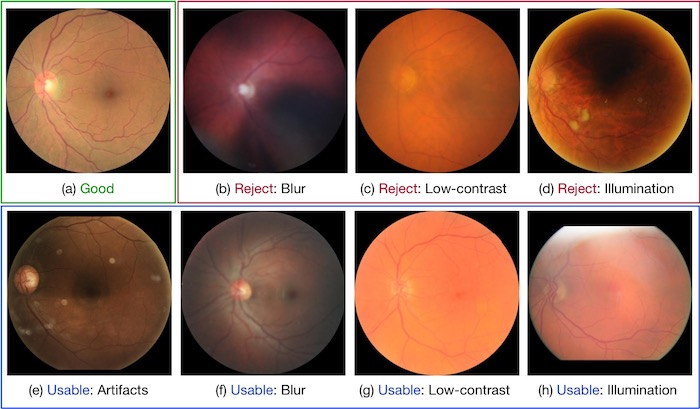

# Eye-Quality (EyeQ) Assessment Dataset 

The project web for ***"Evaluation of Retinal Image Quality Assessment Networks in Different Color-spaces"*** in MICCAI 2019.

**Fundus Enhancement:**
We also have a related work for ***"Modeling and Enhancing Low-quality Retinal Fundus Images"*** in IEEE TMI, 2021. The code is released in [Github: Cofe-Net](https://github.com/joanshen0508/Fundus-correction-cofe-Net)

----------------

## -Introduction:

Eye-Quality (EyeQ) Assessment Dataset is a re-annotatation subset from the [EyePACS dataset](https://www.kaggle.com/c/diabetic-retinopathy-detection) for fundus image quality assessment. 

EyeQ dataset has 28,792 retinal images with a three-level quality grading (i.e., 'Good', 'Usable' and 'Reject').

|      | Train |  -   |  -    | -    | -    |  -     |  Test  | -     |  -    | -    |  -   |   -    | Total  |
| ---  | ---   | ---  | ---   |---   |---   | ---    |  ---   | ---   | ---   | ---  | ---  | ---    |  ---   |
|      | DR-0  | DR-1 | DR-2  | DR-3 | DR-4 |  All   |  DR-0  | DR-1  | DR-2  | DR-3 | DR-4 |  All   |        |          
Good   | 6,342 | 699  | 1,100 | 167  |  39  | 8,347  | 5,966  |  886  | 1,354 | 199  |  65  | 8,470  | 16,817 |    
Usable | 1,353 | 103  |  283  |  79  |  58  | 1,896  | 3,201  |  359  |  721  | 145  | 133  | 4,559  | 6,435  |     
Reject | 1,544 | 109  |  426  |  87  | 154  | 2,320  | 2,195  |  153  |  569  | 104  | 199  | 3,220  | 5,540  |    
Total  | 9,239 | 911  | 1,809 | 333  | 251  | 12,543 | 1,1362 | 1,398 | 2,644 | 448  | 397  | 16,249 | 28,792 |

----------------

## -Usage:

1. The original fundus images could be downloaded from  [EyePACS dataset](https://www.kaggle.com/c/diabetic-retinopathy-detection). 
2. All the original fundus images should be pre-porcessed by *'EyeQ\_process\_main.py'* in folder './EyeQ_preprocess'.
3. The quality label is in './data' folder, where the *'Label\_EyeQ\_train.csv'* and *'Label\_EyeQ\_test.csv'* are divided by EyePACS, and the 'DR\_grade' label is also from EyePACS.
4. We also release our Multiple Color-space Fusion Network (MCF-Net) based on ResNet121 in './MCFNet' folder. 

**Note:** The trained model  of MCF-Net *'DenseNet121\_v3\_v1.tar'* (~112MB) could be download from [OneDrive](https://1drv.ms/u/s!ArBRrL8ao6jznU6RCbo60oStjPWZ?e=3g1VOG).

----------------
## -Reference:

If you use this dataset and code, please cite the following papers:

[1] Huazhu Fu, Boyang Wang, Jianbing Shen, Shanshan Cui, Yanwu Xu, Jiang Liu, Ling Shao, "Evaluation of Retinal Image Quality Assessment Networks in Different Color-spaces", in MICCAI, 2019. [[PDF]](https://arxiv.org/abs/1907.05345) **Note:** The corrected accuracy score of MCF-Net is 0.8800.

---
## -License:

The code is released under the [Creative Commons Attribution-NonCommercial-ShareAlike 4.0 International Public License](https://creativecommons.org/licenses/by-nc-sa/4.0/legalcode) for NonCommercial use only. Any commercial use should get formal permission first.

----------------

Update log:

- 21.12.29: Added link for fundus enhancement project.
- 20.06.18: Corrected the accuracy score.
- 19.11.15: Released the code of MCF-Net.
- 19.07.10: Released the dataset.
